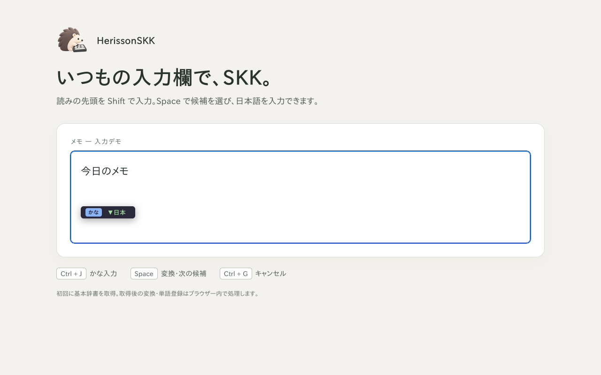

# HerissonSKK

HerissonSKK（えりそん SKK）は、ブラウザーの入力欄で使える SKK 方式の日本語入力拡張です。PC の Firefox・Chrome と、物理キーボードを使う Android の Firefox に対応しています。

- ローマ字かな入力、かな漢字変換、単語登録、候補の学習ができます。
- 通常の入力欄や iframe 内の入力欄に加え、VS Code for the Web（vscode.dev）でも利用できます。
- 初回に基本辞書をダウンロードし、その後の変換はブラウザー内で処理します。入力内容や登録語を変換サーバーへ送信しません。

## インストール

- **Firefox**: [HerissonSKK for Firefox](https://addons.mozilla.org/ja/firefox/addon/herissonskk-for-firefox/)（2026-09-23 時点では公開待ちです）。
- **Chrome**: Chrome Web Store への掲載準備中です。

初回の基本辞書取得にはインターネット接続が必要です。取得済みの辞書による変換はオフラインでも利用できます。

## 基本操作

1. Web ページの入力欄で `Ctrl+j` を押し、かな入力を始めます。
2. `Nihongo`（先頭は `Shift+n`）と入力し、`Space` で変換します。
3. `Space` で次の候補へ進み、`Enter` で確定します。`Ctrl+g` で変換をキャンセルできます。
4. 辞書にない読みは、表示される登録画面で単語を登録します。

ひらがな・カタカナの切り替えは、変換していない状態で `q` を押します。`Ctrl+j` はかな種別を切り替えません。

- [システム辞書の追加・設定](docs/system-dictionaries.md)
- [候補削除（X）の操作と対象](docs/candidate-deletion.md)
- [埋め込み文書での入力と制約](docs/embedded-documents.md)

## 対応範囲と保存データ

Android では物理キーボードが必要です。ソフトウェアキーボードだけでの操作は対応対象に含めません。ブラウザーの内部ページや拡張機能の動作を制限するページでは利用できず、サイト独自の入力欄では動作が異なる場合があります。iframe 内の候補メニューと登録画面は、その iframe の表示領域内に制限されます。

登録語・学習・辞書設定は同じブラウザープロファイルに保存し、ブラウザー間・端末間で同期しません。個人辞書のインポート・エクスポート用画面は未実装です。

外部辞書の取得・更新時には配信先へ通信します。詳しくは[プライバシーポリシー](docs/privacy-policy.md)を参照してください。

## 問い合わせ・不具合の報告

[GitHub Issues](https://github.com/yhayase/HerissonSKK-browser/issues) で受け付けます。不具合の報告には、OS・ブラウザー・拡張機能のバージョン、再現する操作、期待する結果と実際の結果を記載してください。入力例には公開して差し支えない語句を使ってください。

## 制作と AI の利用

HerissonSKK は Yasuhiro Hayase が制作・公開しています。開発には Google Gemini と OpenAI Codex を使用し、コード・テスト・文書の作成や修正、検証作業に AI を活用しています。アイコンは ChatGPT の画像生成で作成し、Codex を用いて調整・整形しました。作者が仕様や採用する変更・図案を判断し、公開内容に対する最終的な責任を負います。

AI は開発・制作時に利用しています。拡張機能の日本語変換は取得済みの SKK 辞書を使い、入力内容や登録語を AI サービスへ送信しません。

## ライセンス

本体コードと付属文書は [MIT ライセンス](LICENSE)です。第三者コードの条件は[ライセンス表示](public/licenses/README.txt)を参照してください。取得する SKK 辞書には辞書固有のライセンスが適用されます。

アイコンは本体 MIT の対象外です。公式アプリの配布・紹介には利用できますが、別製品への流用は作者の個別許可が必要です。詳しくは[アイコンの利用条件](public/licenses/HerissonSKK-icon.txt)を参照してください。

## 開発に参加する

[開発案内](docs/development.md)にビルド・テストとコード構成、[ロードマップ](docs/roadmap.md)に開発状況と今後の課題をまとめています。
