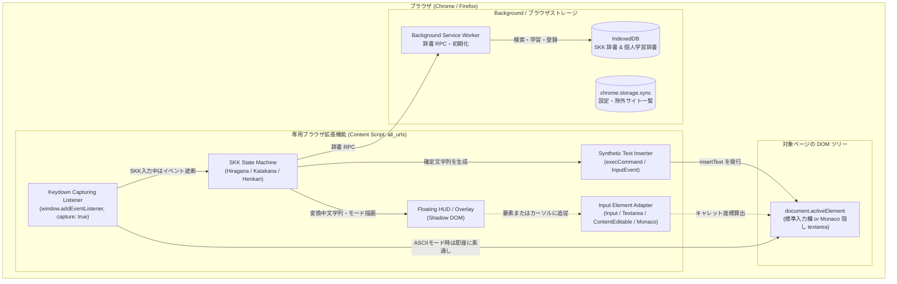

# ブラウザ向け汎用 SKK 入力拡張機能（Chrome / Firefox 対応、VS Code for Web 完全対応）計画書

## 1. 背景と目的
OS レベルで IME（SKK を含む）のインストールが制限・禁止されている環境（企業のシンクライアント、権限制限端末、Chromebook、教育機関等の共有 PC）において、ブラウザ内のあらゆる入力環境で快適な SKK 日本語入力を提供するための専用ブラウザ拡張機能（WebExtension）を構築します。

本拡張機能は、一般的な Web フォーム（`<input>`, `<textarea>`, `contenteditable`）はもちろん、独自の入力モデルを持つ最難関の **VS Code for Web（`vscode.dev`, `github.dev`, `code-server` のエディタ、AI Chat、コマンドパレット等）** にも完全対応し、ブラウザ上でのシームレスな SKK 体験を実現します。

---

## 2. あるべき姿（Vision & Target User）

### どのようなユーザが
- **制限環境の開発者・ワーカー**:
  - セキュリティポリシーや管理者権限の都合により、OS に任意の IME を導入できない環境で作業するすべてのユーザ。
- **Web 版 VS Code および Web アプリのヘビーユーザ**:
  - `vscode.dev`、GitHub Codespaces、`code-server` をはじめ、Web 版の Slack、GitHub Issue/PR、Qiita、Zenn、SNS、メールフォームなどを日常的に利用するユーザ。
- **Chrome / Firefox ユーザ**:
  - デベロッパーモードや管理者権限を必要とせず、公式ストアから 1 クリックで安全に拡張機能を導入したいユーザ。

### 何をできるようにするのか
- **Web 上のあらゆる入力欄でのシームレスな SKK 入力**:
  - 通常のテキストボックスや検索バーから、リッチテキストエディタ、さらには VS Code for Web のエディタ／AI Chat／コマンドパレットに至るまで、同一の操作感で SKK 入力（ひらがな、カタカナ、漢字変換、接頭辞・接尾辞変換）を可能にします。
- **通常のブラウジングを妨げない完全透過設計**:
  - 直接入力（ASCII モード）時はキーイベントを一切阻害せず素通し（パススルー）し、ブラウザや Web サイト固有のショートカットキー（Ctrl+T、Gmail のキーバインド等）と競合しません。
  - `Ctrl+j`（またはカスタマイズ可能なキー）を押した瞬間から SKK モードに切り替わります。
- **サイトごとの柔軟な制御**:
  - 拡張機能のポップアップからワンクリックで「このサイトでは無効にする」といったドメイン単位のトグルが可能です。
- **ゼロコンフィグ＆オフライン・セキュア**:
  - ブラウザローカル（IndexedDB）に SKK 辞書を保持し、入力テキストを外部サーバーへ一切送信しない安全なオフライン変換を提供します。

---

## 3. 実現方法（アイデア・アーキテクチャ）

### 1. クロスブラウザ共通基盤 (Manifest V3)
- **ビルド環境**: WXT (Web Extension Framework) を採用し、単一の TypeScript ソースコードから Chrome 版（CRX）および Firefox 版（XPI）を同時出力。
- **対象範囲**: `manifest.json` の `content_scripts.matches` に `<all_urls>` を指定し、すべての Web ページで稼働可能にします。

### 2. キー入力インターセプトとパススルー制御
- **最速のキャプチャ**: `window.addEventListener('keydown', handleKey, { capture: true })` を `document-start` で登録。
- **透過（パススルー）判定**:
  - フォーカスが入力可能要素（`<input>`, `<textarea>`, `contenteditable`, または Monaco の inputarea）にない場合は即座に何もしない（return）。
  - 現在の SKK 状態が「ASCII（直接入力）モード」で、かつ SKK 起動キー（`Ctrl+j` 等）でない場合は、`event.preventDefault()` を呼ばずにそのままブラウザ／ページにキーを通過させる。
  - SKK 変換バッファが存在する（未確定文字列がある）間のみ、`event.preventDefault()` および `stopPropagation()` でイベントを完全に横取りする。

### 3. 入力要素アダプタ（Input Element Adapter）
多様な入力フォームを透過的に扱うための抽象化レイヤーを設けます。
- **標準フォーム（`<input>`, `<textarea>`）**:
  - `element.selectionStart` / `selectionEnd` によるキャレット制御。
  - `textarea-caret` アルゴリズムによるキャレット画面座標の算出。
- **リッチテキスト（`contenteditable`、Slack、Notion 等）**:
  - `window.getSelection()` によるキャレット座標算出と Range 制御。
- **Monaco Editor（VS Code for Web）**:
  - 隠し textarea（`<textarea class="inputarea">`）を検出し、Monaco が描画する `.cursor` 要素からカーソル画面座標を取得。

### 4. テキスト流し込み（Synthetic Text Inserter）
- `document.activeElement` に対し、`document.execCommand('insertText', false, text)` を実行。
- 現代のブラウザ環境において、標準フォーム、ProseMirror / Lexical などの主要なリッチテキストフレームワーク、および Monaco Editor の内部ドキュメントモデル・Undo 履歴を壊さずに文字を反映できる最も互換性の高い手法を採用します。

### 5. フローティング HUD（Shadow DOM）
- ページ側の CSS（Bootstrap, Tailwind, サイト固有スタイル）と一切干渉しないよう、独立した Shadow DOM 内に入力状態表示 UI を作成。
- キャレット直下（または画面右下に固定）に `[かな] ▽みだし` / `[カナ] ▼候補` を表示。

### 6. 辞書ストレージ（IndexedDB）
- 公式 JSON 辞書、標準テキスト辞書、ユーザー辞書をローカル IndexedDB に保持します。
- IndexedDB の接続、辞書初期化、検索、学習、登録は Background Service Worker に集約します。Content Script は `RemoteJisyoStore` / `RemoteUserStore` の RPC を介して利用し、Web ページの実行コンテキストから辞書データを隔離します。
- システム辞書は辞書 ID と generation を含む複合キーで保存し、投入完了後に active generation を公開します。更新失敗時は旧 generation を維持し、複数辞書の候補順を構成順で合成します。
- v1〜v3 の既存データベースは v4 へ移行し、旧システム辞書とユーザー学習を保持します。Service Worker が停止後に再起動した場合も IndexedDB を開き直して処理を継続します。

---

## 4. 実現にあたっての技術的課題と対策

| 分類 | 課題内容 | 対策・方針 |
| :--- | :--- | :--- |
| **サイト互換性** | サイト固有のショートカット（Gmail, GitHub, Twitter 等）と意図せず競合するリスク。 | ASCII モード時は一切キーイベントを止めず素通しする。除外ドメイン設定（ブラックリスト）を提供。 |
| **特殊アプリ** | Google ドキュメントのように、DOM ではなく `<canvas>` に直接文字を描画している特殊サービスでは動作しない。 | Canvas ベースの独自レンダリングを行う極一部のアプリは技術的限界として「非対応」を明記・割り切り。 |
| **リッチエディタ** | Slack や Notion 等のモダンなリッチテキスト（ProseMirror, Lexical, Draft.js 等）でのキャレット取得や確定処理。 | `document.execCommand('insertText')` は主要なリッチエディタが監視する `beforeinput` イベントを自然にトリガーするため高い互換性を持つ。キャレット位置は `window.getSelection().getRangeAt(0)` から取得。 |
| **ブラウザ差異** | Firefox では `navigator.keyboard.lock()` が未サポートのため、F11 フルスクリーン時でも一部のブラウザショートカット（Ctrl+W 等）が奪われる。 | 競合しやすいキーの代替キーバインド設定を提供。 |
| **拡張機能審査** | Chrome ウェブストアおよび Firefox Add-ons で `<all_urls>`（全サイトアクセス権限）を要求すると審査が厳格化する。 | 「全 Web サイト上のフォームおよびエディタで動作する汎用 IME 拡張機能である」という目的をプライバシーポリシーおよび申請理由書に明記。外部へのテキスト送信を一切行わない（完全オフライン動作）ことをアピール。 |

---

## 5. ロードマップ案

1. **フェーズ 1: 汎用入力 PoC（最小検証）**
   - WXT による拡張機能雛形を作成。
   - 一般的な `<input>`、`<textarea>`、および `vscode.dev` 上で `Ctrl+j` による起動・入力フック・固定文字の流し込みが正しく動作するか検証。
2. **フェーズ 2: SKK コアエンジンの移植**
   - 本リポジトリ（`skk-vscode`）のステートマシン（かな／カナ／全英／見出し語変換／接頭辞・接尾辞）を純粋な TypeScript ライブラリとして切り出して組み込み。
3. **フェーズ 3: キャレット追従 HUD と IndexedDB 辞書**
   - Shadow DOM によるフローティング表示。
   - `textarea-caret` および Monaco カーソル追従ロジックの実装。
   - `SKK-JISYO.L` のローダーと IndexedDB インデックス検索の実装。
4. **フェーズ 4: 設定・除外リスト UI とストア申請準備**
   - ポップアップ UI（有効/無効切り替え、辞書管理）。
   - Chrome / Firefox 向けのビルド自動化とパーミッション整備。
