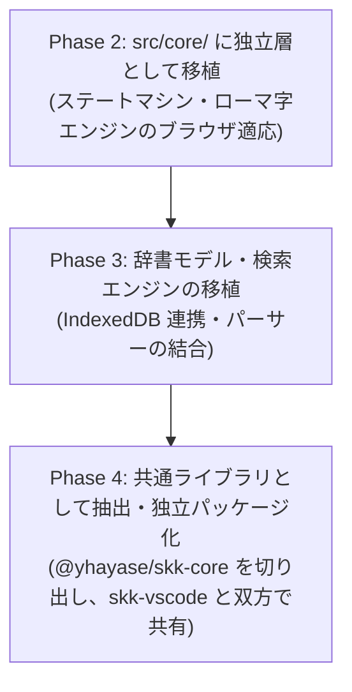

# 開発ロードマップ (Development Roadmap)

本書は、ブラウザ向け汎用 SKK 入力拡張機能（Chrome / Firefox 対応、VS Code for Web 完全対応）の開発フェーズ、マイルストーン、および進捗状況を管理するロードマップです。

全体のアーキテクチャおよび技術的課題・方針については [docs/architecture.md](file:///home/hayase/Documents/devel/skk-browser-extension/docs/architecture.md) を参照してください。

---

## コアエンジン抽出・共通化方針（Library Extraction Strategy）

SKK コアエンジン（ステートマシン、ローマ字変換、辞書モデル）は、既存の `skk-vscode` との重複管理を避け、将来的には単独利用可能な共通ライブラリ（例: `@yhayase/skk-core`）として提供することを目指します。

設計の最適化と手戻り最小化のため、以下の **「移植先行・要件確定後のライブラリ抽出」** アプローチを採用します：

1. **ブラウザ拡張内に独立層（`src/core/`）として先行移植（Phase 2〜3）**:
   - 将来のライブラリ化を見据え、ブラウザ固有依存（DOM / HUD / Chrome API）を一切含まない純粋な TypeScript 層として `src/core/` に構築。
   - ブラウザ特有の要件（DOM を汚染しない未確定バッファと HUD 描画、確定時のみの `insertText` 流し込み、IndexedDB 連携など）を充足させ、`IEditor` / `IJisyoProvider` の境界仕様を固める。
2. **共通ライブラリの抽出・統合（Phase 4）**:
   - 2つの実環境（VS Code 拡張機能とブラウザ拡張機能）で実際に稼働した実績をもとに、共通部分を独立パッケージ（または monorepo）としてくくりだす。
   - `skk-vscode` および `skk-browser-extension` の双方が共通ライブラリを参照するようにリファクタリング。

---

## 全体フェーズ一覧

| フェーズ | テーマ | 状態 | 主な成果物・マイルストーン |
| :--- | :--- | :---: | :--- |
| **Phase 1** | **汎用入力 & Monaco Editor PoC** | **完了 ✅** | キー横取り、汎用要素・Monaco への文字挿入、キャレット追従 HUD、フルスクリーン対応、ヘッドレス E2E テスト |
| **Phase 2** | **SKK コアエンジン移植 & ブラウザ適応** | **完了 ✅** | `src/core/` への純粋 TypeScript 移植（ローマ字変換、各入力モード、接頭辞/接尾辞）、DOM 非汚染な `BrowserEditorAdapter`、単体テスト(137件) |
| **Phase 3** | **辞書ストレージ & 検索エンジン (IndexedDB)** | **次フェーズ 🚀** | SKK 辞書モデル/パーサーの移植、大容量辞書の IndexedDB 格納、高速完全一致/前方一致検索、個人学習辞書 |
| **Phase 4** | **SKK コアエンジンの共通ライブラリ抽出** | 未着手 ⏳ | `src/core/` を独立パッケージ（`@yhayase/skk-core` 等）として切り出し、`skk-vscode` とブラウザ拡張の双方で共通利用 |
| **Phase 5** | **UI/UX 改善 & 候補選択メニュー** | 未着手 ⏳ | 複数候補一覧メニュー（1〜9 選択、Space 送り、x 戻り）、ビューポート端へのクランプ、ダーク/ライトテーマ追従 |
| **Phase 6** | **設定画面・ドメイン制御 & ストア公開準備** | 未着手 ⏳ | ポップアップ UI（有効/無効・除外サイト）、オプション画面（キーバインド・辞書管理）、Chrome/Firefox パッケージング |

---

## 各フェーズ詳細

### Phase 1: 汎用入力 & Monaco Editor PoC（完了 ✅）

- **目的**: 最難関とされる「VS Code for Web（Monaco Editor）でのキー横取り・Undo 履歴を壊さない文字挿入・カーソル追従」および「標準 Web フォームでの入力互換性」の技術的成立性を実証する。
- **実装内容**:
  - WXT (Manifest V3) によるクロスブラウザ拡張機能基盤の構築。
  - `window.addEventListener('keydown', ..., { capture: true })` による確実なイベントキャプチャ。
  - `vscode.dev` / `github.dev` での Native EditContext の安全なバイパス（`<textarea class="inputarea">` フォールバック）。
  - `document.execCommand('insertText')` を用いた Monaco Editor の Undo/Redo 履歴を保持するテキスト挿入。
  - `<input>`, `<textarea>`, `contenteditable`, および Monaco Editor (`.cursor`) の正確なキャレット画面座標追従。
  - Shadow DOM によるページ側 CSS と隔離されたフローティング HUD。
  - HTML5 フルスクリーンモード（`fullscreenchange` による Top Layer 再マウント）対応。
  - 完全ヘッドレス環境（`xvfb-run` + Chrome for Testing + Puppeteer）での E2E 自動検証スクリプト整備。
- **検証結果**: 全 4 種の入力要素において、入力、変換、確定、および Monaco の Undo 動作を確認済み。

---

### Phase 2: SKK コアエンジン移植 & ブラウザ適応（完了 ✅）

- **目的**: `skk-vscode` の SKK 状態遷移マシンおよびローマ字変換ロジックを、将来の共通ライブラリ化を見据えて `src/core/`（環境非依存の純粋 TypeScript 層）に移植し、ブラウザ用のエディタアダプタと統合する。
- **実装内容**:
  1. **環境非依存コア（`src/core/`）の移植**:
     - `romaji/RomKanaRule.ts`, `romaji/RomajiInput.ts` の移植。
     - 入力モード基盤（`IInputMode`, `AbstractInputMode`, `AbstractKanaMode`）。
     - 各入力モードの実装（`HiraganaMode`, `KatakanaMode`, `HankakuKanaMode`, `ZeneiMode`, `AsciiMode`）。
     - 変換モードの実装（`MidashigoMode`, `InlineHenkanMode`, `MenuHenkanMode`, `AbbrevMode`、送りあり/なし、接頭辞/接尾辞 `>`）。
  2. **ブラウザ向けエディタアダプタ (`BrowserEditorAdapter`) の構築**:
     - Web フォームで DOM を汚染しないよう、未確定バッファ（`▽` や `▼`）をメモリ・HUD 側で保持し、確定時のみ `TextInserter` で DOM に流し込む `IEditor` 実装。
     - 送りあり・送りなし・接頭辞/接尾辞変換に対応したインメモリ辞書プロバイダ (`SimpleMemoryJisyoProvider`)。
     - `document.execCommand('delete')` 優先試行による Undo/Redo スタック保護、および非テキスト入力欄での例外回避。
  3. **Content Script への本統合**:
     - `entrypoints/content.ts` を新コアエンジン + `BrowserEditorAdapter` に完全移行。
     - 未確定時以外の Enter キー透過（フォーム送信・改行・インデント保護）、OS ネイティブ IME 入力中（`isComposing`）の衝突回避ガード。
  4. **単体・結合テストの完備**:
     - Vitest による 137 件の単体テスト（全件パス）。
     - Chrome for Testing + `xvfb-run` による全 4 要素（`<input>`, `<textarea>`, `contenteditable`, Monaco Editor）での E2E 自動結合テスト（全件パス）。
- **検証結果**:
  - 全 137 件の単体テストおよび 4 種の入力要素での E2E テストがエラー 0 でパス。Undo 履歴も正常に動作することを確認済み。

---

### Phase 3: 辞書ストレージ & 検索エンジン (IndexedDB)（未着手 ⏳）

- **目的**: ネットワーク通信を行わず完全ローカル・オフラインで動作する高速な SKK 辞書システムを構築する。
- **タスク一覧**:
  1. **SKK 辞書モデル・パーサーの移植**:
     - `candidate.ts`, `entry.ts`, `okuri.ts`, `jisyo.ts` 等のモデルとパースロジックを `src/core/jisyo/` に移植。
  2. **IndexedDB 辞書ストレージの実装**:
     - `SKK-JISYO.L` などの大容量辞書を IndexedDB にインデックス付きで格納。
     - 見出し語による高速完全一致および前方一致クエリの実装（クエリ応答時間 5ms 未満を目標）。
  3. **個人学習辞書（User Jisyo）の実装**:
     - 確定履歴の学習と候補並び替え。
     - ユーザー独自登録単語の永続化。
  4. **初期辞書ロード機構**:
     - 拡張機能バンドル辞書の初回自動インポート、または設定からの辞書ファイル読み込み機能。
- **完了条件**:
  - `SKK-JISYO.L` を取り込み、数十万語の辞書から体感遅延なく漢字変換が行えること。

---

### Phase 4: SKK コアエンジンの共通ライブラリ抽出（未着手 ⏳）

- **目的**: Phase 2〜3 で要件が確定した `src/core/` を独立した TypeScript ライブラリとして抽出し、`skk-vscode` と `skk-browser-extension` でコードを共通化する。
- **タスク一覧**:
  1. **独立パッケージの構成**:
     - 独立リポジトリまたは monorepo パッケージ（例: `@yhayase/skk-core`）としてプロジェクトを初期化。
     - ESM / CJS 両対応のビルドパイプライン（tsup または rollup）と型定義 (`.d.ts`) の出力設定。
     - コアエンジンの単体テストスイートの移行。
  2. **`skk-vscode` への適用**:
     - `skk-vscode` から重複する `src/lib/` コードを削除し、共通ライブラリへの依存に切り替え。
     - VS Code 拡張機能としての既存テストおよび動作確認。
  3. **`skk-browser-extension` への適用**:
     - `src/core/` を共通ライブラリの import に切り替え、結合テストで動作確認。
- **完了条件**:
  - 共通ライブラリへの変更が両プロジェクトに反映可能となり、重複コードが完全に解消されること。

---

### Phase 5: UI/UX 改善 & 候補選択メニュー（未着手 ⏳）

- **目的**: 快適なタイピング体験のためのリッチな視覚フィードバックと候補選択 UI を提供する。
- **タスク一覧**:
  1. **複数候補一覧メニュー (MenuHenkanMode)**:
     - 変換候補が多数ある場合のドロップダウン/ポップアップ候補リスト。
     - 数字キー（1〜9）による直接選択、Space キーによる次候補、`x` キーによる前候補ナビゲーション。
  2. **スマートな配置・クランプ処理**:
     - 画面端（下端・右端）での HUD のはみ出し防止と画面内クランプ。
     - スクロール追従の最適化。
  3. **テーマ・デザイン対応**:
     - ページの背景色や OS のダークモード/ライトモード設定に応じた HUD スタイルの適応。
- **完了条件**:
  - 長い候補一覧でも画面外に見切れず、キーボードのみでストレスなく候補選択・確定ができること。

---

### Phase 6: 設定画面・ドメイン制御 & ストア公開準備（未着手 ⏳）

- **目的**: ユーザーが自由に設定を変更できる UI を整備し、公式ストア（Chrome ウェブストア、Firefox Add-ons）への申請要件を満たす。
- **タスク一覧**:
  1. **ポップアップ UI (Popup Entrypoint)**:
     - サイト単位での有効/無効トグル（ブラックリスト/ホワイトリスト）。
     - 現在のステータス表示。
  2. **設定ページ (Options Entrypoint)**:
     - SKK 起動キーバインド設定（`Ctrl+j`、`Ctrl+Space` 等）。
     - 追加辞書（ユーザー辞書・専門辞書）のインポート/エクスポート/削除。
     - 入力設定（確定キー、句読点スタイル等のカスタマイズ）。
  3. **クロスブラウザパッケージング & ドキュメント整備**:
     - Chrome 版 (CRX) / Firefox 版 (XPI) のビルド・検証。
     - プライバシーポリシーの作成（外部通信を行わない完全ローカル動作の明記）。
     - ストア掲載用アイコン、スクリーンショット、説明文の準備。
- **完了条件**:
  - Chrome / Firefox 双方のストア申請ビルドがエラーなく生成され、設定変更がすべてのタブに即時反映されること。
